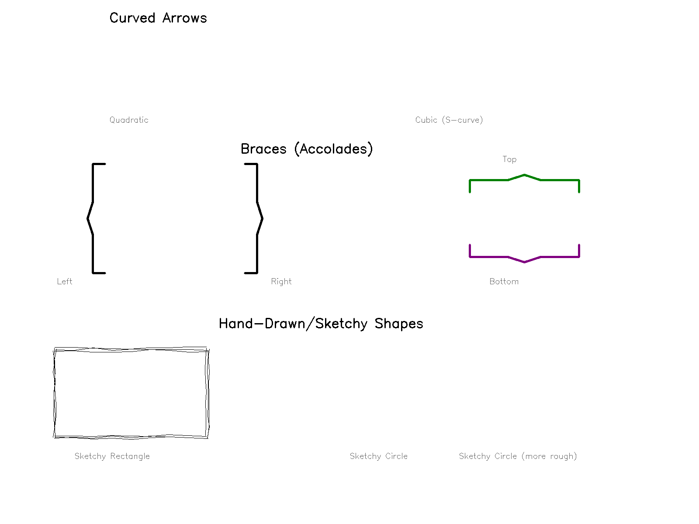

# New Geometric Shapes - Feature Enhancement

This document describes the newly added geometric shapes that enhance the whiteboard animation capabilities.

## Overview

This enhancement adds 4 new shape types to the existing geometric shapes system, addressing the feature request for enriched geometric forms including curved arrows, braces, and hand-drawn shapes.

## New Shape Types

### 1. Curved Arrow

Arrows that follow smooth bezier curves instead of straight lines. Perfect for showing flow, direction, and relationships with natural-looking curved paths.

**Features:**
- Quadratic bezier (3 points) for simple arcs
- Cubic bezier (4 points) for S-curves and complex paths
- Adjustable curve smoothness
- Arrow head automatically positioned at curve end

**Example:**
```json
{
  "shape": "curved_arrow",
  "curve_type": "quadratic",
  "points": [[100, 400], [400, 100], [700, 400]],
  "arrow_size": 35,
  "color": "#FF0000"
}
```

### 2. Brace (Accolade)

Curly braces for grouping, mathematical notation, and highlighting related content.

**Features:**
- Four orientations: left `{`, right `}`, top, bottom
- Adjustable width and height
- Customizable tip size

**Example:**
```json
{
  "shape": "brace",
  "orientation": "left",
  "position": {"x": 200, "y": 500},
  "width": 40,
  "height": 250,
  "color": "#000000"
}
```

### 3. Sketchy Rectangle

Hand-drawn style rectangles with organic, imperfect lines. Creates a casual, sketched appearance perfect for emphasis and highlighting.

**Features:**
- Multiple overlapping strokes for realistic hand-drawn effect
- Adjustable roughness (amount of variation)
- Configurable iterations (number of overlapping strokes)
- Each render is slightly unique due to randomness

**Example:**
```json
{
  "shape": "sketchy_rectangle",
  "position": {"x": 400, "y": 300},
  "width": 300,
  "height": 200,
  "roughness": 3,
  "iterations": 3,
  "color": "#0000FF"
}
```

### 4. Sketchy Circle

Hand-drawn style circles with organic variations. Creates natural-looking circles for encircling or emphasizing elements.

**Features:**
- Multiple overlapping strokes
- Adjustable roughness for variation
- Configurable iterations
- Natural, organic appearance

**Example:**
```json
{
  "shape": "sketchy_circle",
  "position": {"x": 400, "y": 300},
  "size": 120,
  "roughness": 3,
  "iterations": 3,
  "color": "#FF00FF"
}
```

## Visual Showcase



The showcase demonstrates:
- Curved arrows with quadratic and cubic bezier curves
- Braces in all four orientations (left, right, top, bottom)
- Sketchy rectangles and circles with hand-drawn appearance

## Use Cases

### 1. Educational Content
- **Curved arrows**: Show flow in biological processes, chemical reactions
- **Braces**: Mathematical equations, grouping related concepts
- **Sketchy shapes**: Casual annotations, emphasis in informal presentations

### 2. Presentations
- **Curved arrows**: Natural-looking flow diagrams
- **Braces**: Grouping related items in lists
- **Sketchy shapes**: Highlighting key points with casual style

### 3. Technical Documentation
- **Curved arrows**: Complex system flows with curved paths
- **Braces**: Grouping code blocks or related components
- **Sketchy shapes**: Informal diagrams and wireframes

### 4. Design & Wireframes
- **Sketchy shapes**: Lo-fi wireframes and mockups
- **Curved arrows**: User flow diagrams
- **Braces**: Grouping UI elements

## Integration with Existing Features

All new shapes work seamlessly with:
- ✅ Progressive drawing animation (mode: "draw")
- ✅ Static display (mode: "static")
- ✅ Entrance animations (fade_in, zoom_in, slide_in_*)
- ✅ Exit animations (fade_out, zoom_out, slide_out_*)
- ✅ Morphing between shapes
- ✅ Layer z-index ordering
- ✅ Color customization (RGB/hex)
- ✅ Stroke width customization
- ✅ Fill colors (where applicable)

## Testing

### Run Tests
```bash
# Test all original shapes (7 tests)
python test_shapes.py

# Test new shapes (9 tests)
python test_new_shapes.py

# Create visual showcase
python create_showcase.py
```

All tests pass successfully:
- ✅ Original shapes: 7/7 passing
- ✅ New shapes: 9/9 passing

## Example Configuration

See `example_new_shapes.json` for a complete example demonstrating all new shape types with various configurations and animations.

## Performance

- New shapes render with same performance as original shapes (< 1ms)
- Sketchy shapes use randomness but render quickly
- No impact on existing shape performance
- Scales well with multiple shapes

## Backward Compatibility

- ✅ 100% backward compatible
- ✅ No breaking changes
- ✅ Existing configurations work unchanged
- ✅ New shapes are opt-in only

## Implementation Details

### Files Modified
- `whiteboard_animator.py`: Added new shape type handlers to `render_shape_to_image()`
- `SHAPES_GUIDE.md`: Added documentation for new shapes
- `SHAPES_IMPLEMENTATION_SUMMARY.md`: Updated feature completion status

### Files Added
- `test_new_shapes.py`: Comprehensive tests for new shapes
- `create_showcase.py`: Visual showcase generator
- `new_shapes_showcase.png`: Visual demonstration
- `example_new_shapes.json`: Example configuration
- `NEW_SHAPES_README.md`: This file

### Code Changes
- Leveraged existing bezier curve functions for curved arrows
- Added ~250 lines of new shape rendering code
- All changes contained within shape rendering function
- No changes to animation pipeline or layer system

## Related Documentation

- [SHAPES_GUIDE.md](SHAPES_GUIDE.md) - Complete shapes user guide
- [SHAPES_IMPLEMENTATION_SUMMARY.md](SHAPES_IMPLEMENTATION_SUMMARY.md) - Implementation details
- [QUICKSTART_SHAPES.md](QUICKSTART_SHAPES.md) - Quick start guide

## Author

Implementation by GitHub Copilot addressing issue "enrichi les forme geometriques" (enrich geometric shapes).
