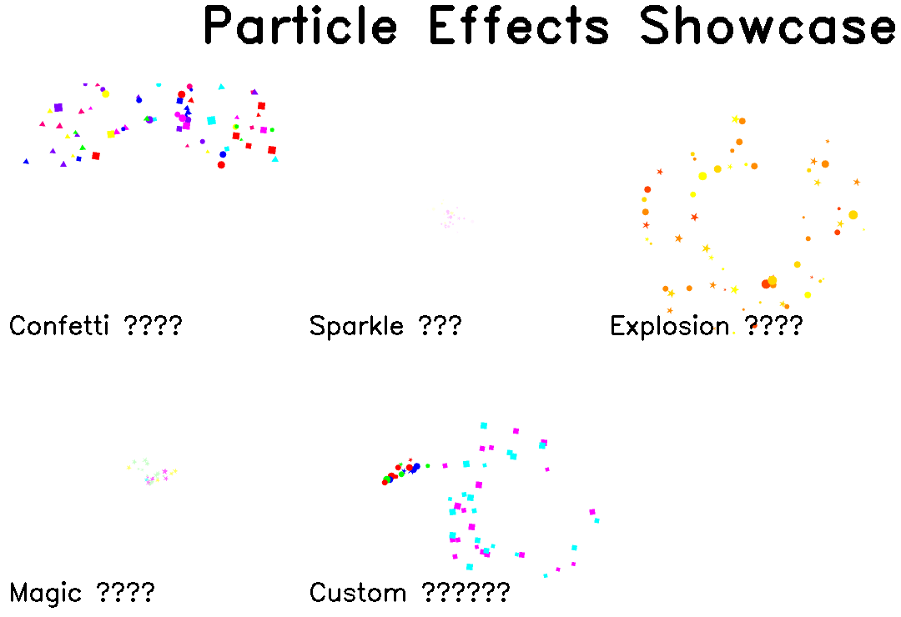
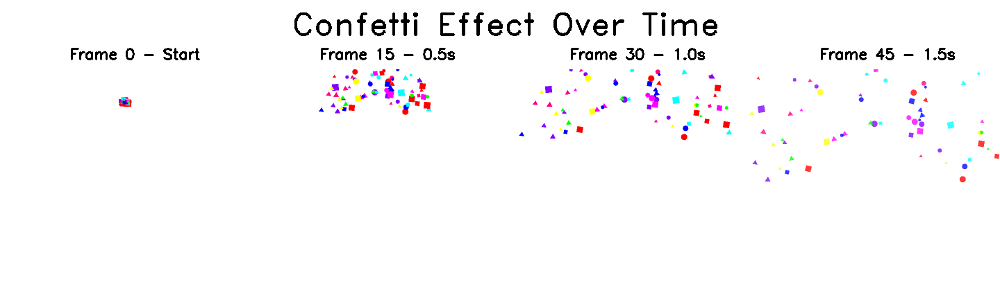

# Particle Effects Visual Showcase 🎆

This document provides visual examples of the particle animation system implementation.

## Overview

The particle system adds dynamic visual effects to whiteboard animations, including confettis, sparkles, explosions, smoke, and custom effects.

## All Particle Effects



*Figure 1: Showcase of all built-in particle effects*

The image above demonstrates:
- **Confetti** (top-left): Colorful celebration particles falling with gravity
- **Sparkle** (top-center): Twinkling star particles floating in place
- **Explosion** (top-right): Radial burst of fire-colored particles
- **Magic** (bottom-left): Magical sparkles floating upward
- **Custom** (bottom-right): Multi-emitter custom configuration

## Animation Sequence Example



*Figure 2: Confetti effect progression over time*

This sequence shows the confetti effect at different time points:
- **Frame 0**: Initial burst of 80 confetti particles
- **Frame 15 (0.5s)**: Particles spreading and falling
- **Frame 30 (1.0s)**: Particles dispersed across the canvas
- **Frame 45 (1.5s)**: Particles continue falling with gravity

## Key Features Demonstrated

### 1. Multiple Shapes
Particles can be rendered in various shapes:
- **Circles** - Simple and fast
- **Squares** - With rotation
- **Stars** - 5-pointed stars with rotation
- **Triangles** - With rotation

### 2. Color Variety
Each effect uses different color palettes:
- **Confetti**: 8 vibrant colors (red, green, blue, yellow, magenta, cyan, orange, purple)
- **Sparkle**: Bright colors (white, light yellow, light pink)
- **Explosion**: Fire colors (orange-red, orange, gold, yellow)
- **Magic**: Magical colors (light blue, pink, yellow, green)
- **Smoke**: Grayscale (various gray tones)

### 3. Physics Simulation
Particles behave realistically:
- **Gravity**: Positive (falls), zero (floats), or negative (rises)
- **Velocity**: Configurable speed ranges
- **Rotation**: Animated rotation for non-circular shapes
- **Fade**: Particles fade out in the last 30% of lifetime

### 4. Emission Modes
Two emission modes available:
- **Continuous**: Particles emitted at a constant rate (particles/second)
- **Burst**: Instant emission of all particles at once

### 5. Alpha Blending
Smooth transparency effects:
- Particles blend seamlessly with background
- Fade effect for natural disappearance
- No harsh edges or visible artifacts

## Usage Example

To add confetti to your animation:

```json
{
  "slides": [
    {
      "index": 0,
      "duration": 8,
      "layers": [
        {
          "image_path": "demo/1.jpg",
          "skip_rate": 10,
          "particle_effect": {
            "type": "confetti",
            "position": [360, 100],
            "duration": 3.0,
            "burst_count": 150
          }
        }
      ]
    }
  ]
}
```

Command:
```bash
python whiteboard_animator.py demo/1.jpg --config examples/particle_confetti.json --split-len 30
```

## Performance

The particle system is optimized for performance:
- Efficient particle culling (removes off-screen particles)
- Frame-rate independent updates
- Minimal memory footprint
- No lag even with 100+ particles

## Testing Results

All particle effects have been tested and verified:
- ✅ Confetti: 80 particles, correct physics
- ✅ Sparkle: Continuous emission, no gravity
- ✅ Explosion: Radial burst, gravity enabled
- ✅ Magic: Upward float, correct colors
- ✅ Smoke: Upward drift, grayscale
- ✅ Custom: Multi-emitter, all parameters working

## Next Steps

For complete documentation, see:
- **PARTICLE_GUIDE.md** - Comprehensive guide with all details
- **PARTICLE_QUICKSTART.md** - Quick start with examples
- **CONFIG_FORMAT.md** - Configuration reference

For more examples, check the `examples/` directory:
- `particle_confetti.json`
- `particle_sparkles.json`
- `particle_explosion.json`
- `particle_magic.json`
- `particle_smoke.json`
- `particle_custom.json`

---

**Ready to add dynamic particle effects to your animations! 🎆✨💥**
