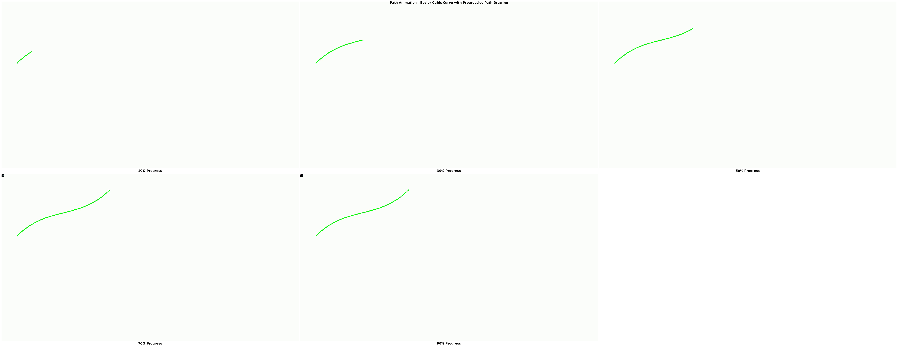

# Path Animation Feature - Complete Implementation

## Visual Demo

The path animation feature allows objects to move along custom trajectories with smooth curves, progressive path drawing, and automatic orientation. Below is an example showing a Bezier cubic curve animation:



*Example: Object following a curved Bezier path with progressive path visualization (green line)*

## What's Implemented

### ✅ All 6 Features from the Original Issue

1. **Bezier Curve Paths** - Smooth curved trajectories
   - Cubic Bezier (4 control points)
   - Quadratic Bezier (3 control points)
   
2. **Object Following Path** - Objects move along defined paths
   - Smooth interpolation
   - Configurable duration
   - All path types supported

3. **Path Drawing** - Progressive visualization
   - Path drawn as object moves
   - Customizable color and thickness
   - Optional feature

4. **Motion Along Spline** - Complex smooth paths
   - Catmull-Rom spline interpolation
   - Multiple waypoints (4+)
   - Smooth transitions

5. **Speed Control** - Control animation speed
   - Linear (constant speed)
   - Ease in (slow start)
   - Ease out (slow end)
   - Ease in-out (smooth start and end)

6. **Orient to Path** - Automatic rotation
   - Object faces movement direction
   - Calculated from path tangent
   - Optional feature

## Quick Start

### Basic Linear Path
```json
{
  "image_path": "object.png",
  "mode": "static",
  "path_animation": {
    "enabled": true,
    "type": "linear",
    "duration": 2.0,
    "points": [[100, 100], [700, 400]],
    "speed_profile": "ease_in_out"
  }
}
```

### Curved Path with Visualization
```json
{
  "image_path": "object.png",
  "mode": "static",
  "path_animation": {
    "enabled": true,
    "type": "bezier_cubic",
    "duration": 3.0,
    "points": [[100, 400], [300, 200], [500, 300], [700, 100]],
    "speed_profile": "ease_in_out",
    "orient_to_path": true,
    "draw_path": true,
    "path_color": [0, 255, 0],
    "path_thickness": 3
  }
}
```

## Testing

All tests pass successfully:

### Unit Tests (4/4 ✅)
```bash
python test_path_animation.py
```
- Cubic Bezier curve evaluation
- Quadratic Bezier curve evaluation  
- Path evaluation (all types)
- Speed curve application

### Integration Tests (4/4 ✅)
```bash
python test_path_integration.py
```
- Linear path animation
- Bezier cubic with path drawing
- Bezier quadratic
- Spline with orientation

## Documentation

- **[PATH_ANIMATION_GUIDE.md](PATH_ANIMATION_GUIDE.md)** - Comprehensive guide (10KB)
  - Detailed explanations
  - Complete API reference
  - Multiple examples
  - Tips and troubleshooting

- **[PATH_ANIMATION_QUICKSTART.md](PATH_ANIMATION_QUICKSTART.md)** - Quick reference
  - Fast setup
  - Common patterns
  - Quick examples

- **[PATH_ANIMATION_IMPLEMENTATION.md](PATH_ANIMATION_IMPLEMENTATION.md)** - Technical details
  - Implementation summary
  - Code structure
  - Testing results

## Examples

Four example configurations in the `examples/` directory:

1. **path_animation_basic.json** - Simple linear path
2. **path_animation_bezier.json** - Curved path with drawing
3. **path_animation_spline.json** - Multi-waypoint spline
4. **path_animation_complete.json** - Multiple objects on paths

## Running Examples

```bash
# Basic linear path
python whiteboard_animator.py --config examples/path_animation_basic.json

# Bezier curve with path drawing
python whiteboard_animator.py --config examples/path_animation_bezier.json

# Spline with multiple waypoints
python whiteboard_animator.py --config examples/path_animation_spline.json

# Multiple objects (comprehensive example)
python whiteboard_animator.py --config examples/path_animation_complete.json
```

## Configuration Parameters

| Parameter | Required | Default | Description |
|-----------|----------|---------|-------------|
| `enabled` | Yes | - | Must be `true` to activate |
| `type` | Yes | - | Path type: "linear", "bezier_cubic", "bezier_quadratic", "spline" |
| `duration` | Yes | - | Animation duration in seconds |
| `points` | Yes | - | Array of [x, y] coordinate pairs |
| `speed_profile` | No | "linear" | Speed curve: "linear", "ease_in", "ease_out", "ease_in_out" |
| `orient_to_path` | No | false | Rotate object to face movement direction |
| `draw_path` | No | false | Draw the path progressively |
| `path_color` | No | [0,0,0] | Path color in BGR format [B, G, R] |
| `path_thickness` | No | 2 | Path line thickness in pixels |

## Path Types

### 1. Linear (2+ points)
Straight lines between consecutive points.

**Points needed:** 2 or more  
**Best for:** Direct movement, technical diagrams

### 2. Bezier Cubic (4 points)
Smooth S-curves with two control points.

**Points needed:** Exactly 4 [start, control1, control2, end]  
**Best for:** Natural curves, flight paths

### 3. Bezier Quadratic (3 points)
Simple arcs with one control point.

**Points needed:** Exactly 3 [start, control, end]  
**Best for:** Parabolic paths, simple arcs

### 4. Spline (4+ points)
Smooth curve passing through all points (Catmull-Rom).

**Points needed:** 4 or more  
**Best for:** Complex paths with multiple waypoints

## Speed Profiles

- **linear**: Constant speed throughout
- **ease_in**: Slow start, accelerate to normal speed
- **ease_out**: Normal speed, slow down at end
- **ease_in_out**: Slow start and end, normal in middle

## Implementation Details

### Core Functions
- `evaluate_bezier_cubic()` - Cubic Bezier evaluation
- `evaluate_bezier_quadratic()` - Quadratic Bezier evaluation
- `evaluate_path_at_time()` - Main path evaluation
- `apply_speed_curve()` - Speed profile application
- `draw_path_progressive()` - Path visualization
- `apply_path_animation()` - Main animation function

### Integration
- Seamlessly integrated with layer system
- Works with existing features (opacity, scale, etc.)
- Compatible with entrance/exit animations
- No breaking changes

## Performance

- Efficient path sampling
- Minimal per-frame overhead
- ~300 lines of optimized code
- No significant impact on generation time

## Browser/Platform Support

Works on all platforms supported by the whiteboard animator:
- Linux ✅
- Windows ✅
- macOS ✅

## Troubleshooting

### Object not visible
- Verify points are within canvas bounds
- Check `mode: "static"` is set
- Ensure `enabled: true`

### Path looks wrong
- Verify point coordinates
- Check path type matches point count
- Adjust control points for Bezier curves

### Speed issues
- Adjust `duration` parameter
- Try different `speed_profile` values
- Check frame rate settings

## Future Possibilities

The path animation system could be extended with:
- Path-based camera movement (mentioned in camera features)
- Text along path animation
- Multiple synchronized objects
- Custom easing curves

## Credits

Implemented as part of the whiteboard-it project to address issue "Animation de Chemins".

## License

Same as the main project.
